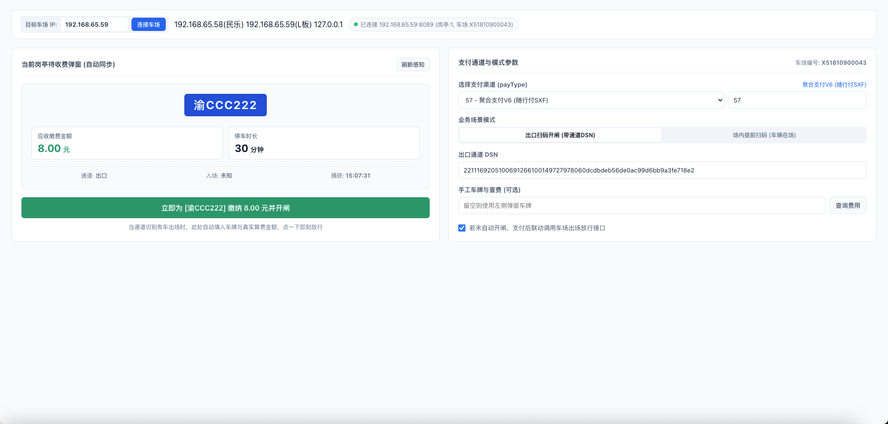

# drzk-pay-sim (道尔车场支付模拟与弹窗感知台)

道尔云 5.0 智慧停车系统的轻量化本地电子支付模拟与岗亭弹窗感知工具。
采用纯 Rust 开发，单文件二进制（约 800KB），无需安装 Python 或任何复杂依赖，开箱即用。



---

## 核心特性

- **双栏极简现代控制台**：无花哨图标，纯净高效的工程师级 UI。
- **岗亭收费弹窗感知雷达**：
  - 挂载在车场 WebSocket 通道上，当通道相机识别或岗亭弹出收费框时，自动抓取并呈现车牌、通道、应缴金额（分转元）；
  - 提供「立即代缴开闸放行」按钮，一键全自动下发支付并联动开闸。
- **动态多车场 IP 切换**：
  - 支持随时输入任意车场 IP 并一键连接；
  - 自动探测目标车场的唯一车场编号（`PARK_NUM`，如民乐村 `H51810900057`、L板 `X51810900043`）与在线岗亭操作员，避免跨车场错发。
- **全量支付渠道支持**：
  - 内置系统完整数据字典：微信直连(1)、支付宝直连(2)、随行付聚合V6(57)、ETC支付(21)、银联闪付(3)、无感支付(101/102)等；
  - 支持自由输入任意自定义数字编码。
- **内置原生轻量 MQTT 3.1.1 客户端**：
  - 纯标准 TCP 实现，无需 C 动态库，毫秒级直连云端 EMQX Broker 下发支付报文。
- **HTTP REST API 接口支持**：
  - 提供 `/api/pay`、`/api/popup/current`、`/api/server/switch`、`/api/fee/current` 等接口，方便与自动化脚本、CI/CD 或第三方平台集成。

---

## 快速使用

### 1. Web 界面模式 (默认)
直接运行程序，后台会自动启动 HTTP 服务，并在默认浏览器中自动打开控制台：
```bash
./drzk-pay-sim
```
访问地址：`http://127.0.0.1:18766`

如需指定端口或目标车场 IP：
```bash
./drzk-pay-sim --port 18766 --server 192.168.65.58
```

### 2. CLI 命令行模式 (单次执行)
在终端中直接指定参数下发支付：
```bash
# 向 192.168.65.58 注入一笔 10 元随行付支付 (pay_type=57)
./drzk-pay-sim --car 粤B88801 --money 10.0 --server 192.168.65.58

# 微信支付并联动开闸
./drzk-pay-sim --car 粤B88802 --money 15.0 --server 192.168.65.59 --pay-type 1 --auto-out
```

---

## 编译构建

需预先安装 Rust 工具链（1.70+）：
```bash
cargo build --release
```
编译生成的可执行文件位于 `target/release/drzk-pay-sim`。

---

## 许可证
内部测试工具 · Proprietary
